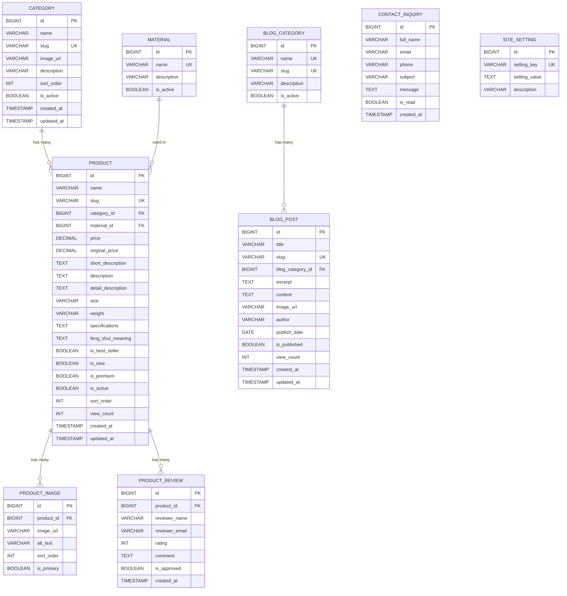

# ERD — Đồ Đồng Mỹ Nghệ Database Design

## Sơ đồ ERD

---

## Chi tiết từng bảng

### 1. `category` — Danh mục sản phẩm
| Cột | Kiểu | Ràng buộc | Mô tả |
|-----|------|-----------|-------|
| `id` | BIGINT | PK, AUTO_INCREMENT | |
| `name` | VARCHAR(100) | NOT NULL | Tượng Đồng, Đỉnh Đồng, ... |
| `slug` | VARCHAR(100) | UNIQUE, NOT NULL | `tuong-dong`, `dinh-dong`, ... |
| `image_url` | VARCHAR(500) | | Ảnh đại diện danh mục |
| `description` | VARCHAR(500) | | Mô tả ngắn |
| `sort_order` | INT | DEFAULT 0 | Thứ tự hiển thị |
| `is_active` | BOOLEAN | DEFAULT TRUE | Ẩn/hiện |
| `created_at` | TIMESTAMP | DEFAULT NOW | |
| `updated_at` | TIMESTAMP | ON UPDATE | |

> [!NOTE]
> `product_count` không cần lưu DB — dùng `COUNT()` query từ bảng product.

---

### 2. `material` — Chất liệu (chuẩn hóa từ chuỗi hardcode)
| Cột | Kiểu | Ràng buộc | Mô tả |
|-----|------|-----------|-------|
| `id` | BIGINT | PK, AUTO_INCREMENT | |
| `name` | VARCHAR(100) | UNIQUE, NOT NULL | Đồng đỏ nguyên chất, Đồng vàng, ... |
| `description` | VARCHAR(500) | | |
| `is_active` | BOOLEAN | DEFAULT TRUE | |

---

### 3. `product` — Sản phẩm (bảng chính)
| Cột | Kiểu | Ràng buộc | Mô tả |
|-----|------|-----------|-------|
| `id` | BIGINT | PK, AUTO_INCREMENT | |
| `name` | VARCHAR(255) | NOT NULL | Tên sản phẩm |
| `slug` | VARCHAR(255) | UNIQUE, NOT NULL | URL-friendly |
| `category_id` | BIGINT | FK → category.id | Danh mục |
| `material_id` | BIGINT | FK → material.id | Chất liệu |
| `price` | DECIMAL(15,0) | NOT NULL | Giá bán (VNĐ, không thập phân) |
| `original_price` | DECIMAL(15,0) | NULLABLE | Giá gốc (trước giảm) |
| `short_description` | TEXT | | Mô tả ngắn cho card |
| `description` | TEXT | | Mô tả chung |
| `detail_description` | TEXT | | Mô tả chi tiết (tab) |
| `size` | VARCHAR(100) | | Kích thước |
| `weight` | VARCHAR(50) | | Trọng lượng |
| `specifications` | TEXT | | Thông số kỹ thuật |
| `feng_shui_meaning` | TEXT | | Ý nghĩa phong thủy |
| `is_best_seller` | BOOLEAN | DEFAULT FALSE | Flag bán chạy |
| `is_new` | BOOLEAN | DEFAULT FALSE | Flag mới |
| `is_premium` | BOOLEAN | DEFAULT FALSE | Flag cao cấp |
| `is_active` | BOOLEAN | DEFAULT TRUE | Ẩn/hiện |
| `sort_order` | INT | DEFAULT 0 | Thứ tự |
| `view_count` | INT | DEFAULT 0 | Lượt xem |
| `created_at` | TIMESTAMP | DEFAULT NOW | |
| `updated_at` | TIMESTAMP | ON UPDATE | |

> [!IMPORTANT]
> `price` dùng `DECIMAL(15,0)` thay vì `VARCHAR` — dễ sort, filter theo khoảng giá. Format hiển thị `15.800.000₫` xử lý ở Thymeleaf bằng `#numbers.formatInteger()`.

---

### 4. `product_image` — Ảnh sản phẩm (1-N)
| Cột | Kiểu | Ràng buộc | Mô tả |
|-----|------|-----------|-------|
| `id` | BIGINT | PK, AUTO_INCREMENT | |
| `product_id` | BIGINT | FK → product.id, ON DELETE CASCADE | |
| `image_url` | VARCHAR(500) | NOT NULL | Đường dẫn ảnh |
| `alt_text` | VARCHAR(255) | | SEO alt text |
| `sort_order` | INT | DEFAULT 0 | Thứ tự |
| `is_primary` | BOOLEAN | DEFAULT FALSE | Ảnh chính (thumbnail) |

---

### 5. `blog_category` — Danh mục blog
| Cột | Kiểu | Ràng buộc | Mô tả |
|-----|------|-----------|-------|
| `id` | BIGINT | PK, AUTO_INCREMENT | |
| `name` | VARCHAR(100) | UNIQUE | Kiến thức phong thủy, Nghệ thuật đồng, ... |
| `slug` | VARCHAR(100) | UNIQUE | |
| `description` | VARCHAR(500) | | |
| `is_active` | BOOLEAN | DEFAULT TRUE | |

---

### 6. `blog_post` — Bài viết
| Cột | Kiểu | Ràng buộc | Mô tả |
|-----|------|-----------|-------|
| `id` | BIGINT | PK, AUTO_INCREMENT | |
| `title` | VARCHAR(255) | NOT NULL | |
| `slug` | VARCHAR(255) | UNIQUE, NOT NULL | |
| `blog_category_id` | BIGINT | FK → blog_category.id | |
| `excerpt` | TEXT | | Mô tả ngắn |
| `content` | TEXT | | Nội dung HTML đầy đủ |
| `image_url` | VARCHAR(500) | | Thumbnail |
| `author` | VARCHAR(100) | | |
| `publish_date` | DATE | | |
| `is_published` | BOOLEAN | DEFAULT FALSE | |
| `view_count` | INT | DEFAULT 0 | |
| `created_at` | TIMESTAMP | | |
| `updated_at` | TIMESTAMP | | |

---

### 7. `product_review` — Đánh giá sản phẩm
| Cột | Kiểu | Ràng buộc | Mô tả |
|-----|------|-----------|-------|
| `id` | BIGINT | PK, AUTO_INCREMENT | |
| `product_id` | BIGINT | FK → product.id | |
| `reviewer_name` | VARCHAR(100) | NOT NULL | |
| `reviewer_email` | VARCHAR(255) | | |
| `rating` | INT | CHECK (1-5) | Số sao |
| `comment` | TEXT | | |
| `is_approved` | BOOLEAN | DEFAULT FALSE | Duyệt trước khi hiển thị |
| `created_at` | TIMESTAMP | | |

---

### 8. `contact_inquiry` — Form liên hệ
| Cột | Kiểu | Ràng buộc | Mô tả |
|-----|------|-----------|-------|
| `id` | BIGINT | PK, AUTO_INCREMENT | |
| `full_name` | VARCHAR(100) | NOT NULL | |
| `email` | VARCHAR(255) | | |
| `phone` | VARCHAR(20) | | |
| `subject` | VARCHAR(255) | | |
| `message` | TEXT | NOT NULL | |
| `is_read` | BOOLEAN | DEFAULT FALSE | |
| `created_at` | TIMESTAMP | | |

---

### 9. `site_setting` — Cấu hình trang (hotline, địa chỉ, ...)
| Cột | Kiểu | Ràng buộc | Mô tả |
|-----|------|-----------|-------|
| `id` | BIGINT | PK, AUTO_INCREMENT | |
| `setting_key` | VARCHAR(100) | UNIQUE, NOT NULL | `company_name`, `hotline`, `address`, ... |
| `setting_value` | TEXT | | |
| `description` | VARCHAR(255) | | |

---

## Mapping từ code hiện tại → DB

| Hiện tại (hardcode) | DB mới | Thay đổi |
|---------------------|--------|----------|
| `Product.category` (String) | `product.category_id` (FK) | Chuẩn hóa thành FK |
| `Product.categorySlug` (String) | Lấy qua JOIN `category.slug` | Bỏ field thừa |
| `Product.material` (String) | `product.material_id` (FK) | Chuẩn hóa thành FK |
| `Product.price` (String "15.800.000₫") | `product.price` (DECIMAL) | Lưu số, format ở view |
| `Product.images` (List String) | `product_image` (bảng riêng) | Chuẩn hóa 1-N |
| `BlogPost.category` (String) | `blog_post.blog_category_id` (FK) | Chuẩn hóa |
| `BlogPost.publishDate` (String) | `blog_post.publish_date` (DATE) | Dùng kiểu DATE |
| `Category.productCount` (int) | `COUNT()` query | Tính động |

---

## Dữ liệu ban đầu (Seed Data)

### Categories
| id | name | slug |
|----|------|------|
| 1 | Tượng Đồng | tuong-dong |
| 2 | Đỉnh Đồng | dinh-dong |
| 3 | Tranh Đồng | tranh-dong |
| 4 | Đồ Phong Thủy | do-phong-thuy |
| 5 | Đồ Thờ | do-tho-dong |
| 6 | Quà Tặng Doanh Nghiệp | qua-tang |

### Materials
| id | name |
|----|------|
| 1 | Đồng đỏ nguyên chất |
| 2 | Đồng vàng |
| 3 | Đồng đỏ |

### Blog Categories
| id | name | slug |
|----|------|------|
| 1 | Kiến thức phong thủy | kien-thuc-phong-thuy |
| 2 | Nghệ thuật đồng | nghe-thuat-dong |
| 3 | Bảo quản đồ đồng | bao-quan-do-dong |
| 4 | Tin tức thị trường | tin-tuc-thi-truong |

---

## Quan hệ tổng kết

| Quan hệ | Kiểu |
|---------|------|
| Category → Product | 1:N |
| Material → Product | 1:N |
| Product → Product_Image | 1:N |
| Product → Product_Review | 1:N |
| Blog_Category → Blog_Post | 1:N |

> [!TIP]
> **Tổng cộng 9 bảng** — đủ để quản lý toàn bộ nội dung website mà không cần hardcode. Có thể mở rộng thêm bảng `order`, `customer`, `wishlist` khi cần tính năng e-commerce thực sự.
