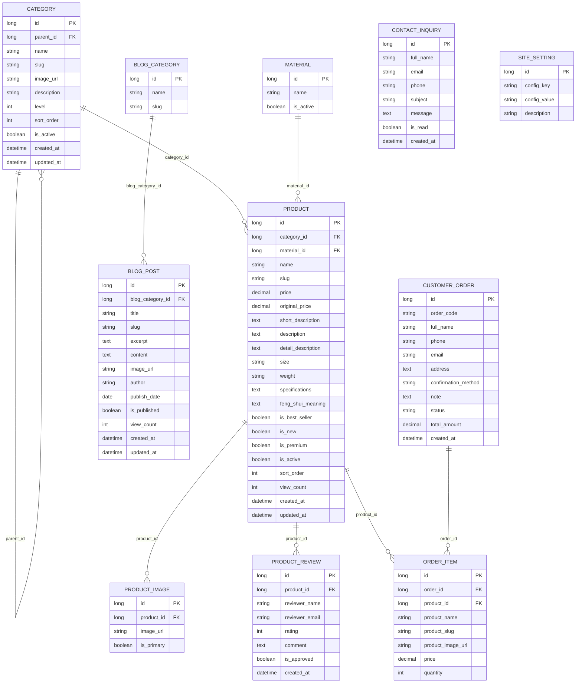

# Entity Relationship Diagram (ERD)

```mermaid
erDiagram
    CATEGORY ||--o{ CATEGORY : "parent_id"
    CATEGORY ||--o{ PRODUCT : "category_id"
    MATERIAL ||--o{ PRODUCT : "material_id"
    PRODUCT ||--o{ PRODUCT_IMAGE : "product_id"
    PRODUCT ||--o{ PRODUCT_REVIEW : "product_id"
    PRODUCT ||--o{ ORDER_ITEM : "product_id"
    CUSTOMER_ORDER ||--o{ ORDER_ITEM : "order_id"
    BLOG_CATEGORY ||--o{ BLOG_POST : "blog_category_id"

    CATEGORY {
        long id PK
        long parent_id FK
        string name
        string slug
        string image_url
        string description
        int level
        int sort_order
        boolean is_active
        datetime created_at
        datetime updated_at
    }

    PRODUCT {
        long id PK
        long category_id FK
        long material_id FK
        string name
        string slug
        decimal price
        decimal original_price
        text short_description
        text description
        text detail_description
        string size
        string weight
        text specifications
        text feng_shui_meaning
        boolean is_best_seller
        boolean is_new
        boolean is_premium
        boolean is_active
        int sort_order
        int view_count
        datetime created_at
        datetime updated_at
    }

    MATERIAL {
        long id PK
        string name
        boolean is_active
    }

    PRODUCT_IMAGE {
        long id PK
        long product_id FK
        string image_url
        boolean is_primary
    }

    PRODUCT_REVIEW {
        long id PK
        long product_id FK
        string reviewer_name
        string reviewer_email
        int rating
        text comment
        boolean is_approved
        datetime created_at
    }

    CUSTOMER_ORDER {
        long id PK
        string order_code
        string full_name
        string phone
        string email
        text address
        string confirmation_method
        text note
        string status
        decimal total_amount
        datetime created_at
    }

    ORDER_ITEM {
        long id PK
        long order_id FK
        long product_id FK
        string product_name
        string product_slug
        string product_image_url
        decimal price
        int quantity
    }

    BLOG_CATEGORY {
        long id PK
        string name
        string slug
    }

    BLOG_POST {
        long id PK
        long blog_category_id FK
        string title
        string slug
        text excerpt
        text content
        string image_url
        string author
        date publish_date
        boolean is_published
        int view_count
        datetime created_at
        datetime updated_at
    }

    CONTACT_INQUIRY {
        long id PK
        string full_name
        string email
        string phone
        string subject
        text message
        boolean is_read
        datetime created_at
    }

    SITE_SETTING {
        long id PK
        string config_key
        string config_value
        string description
    }
```
